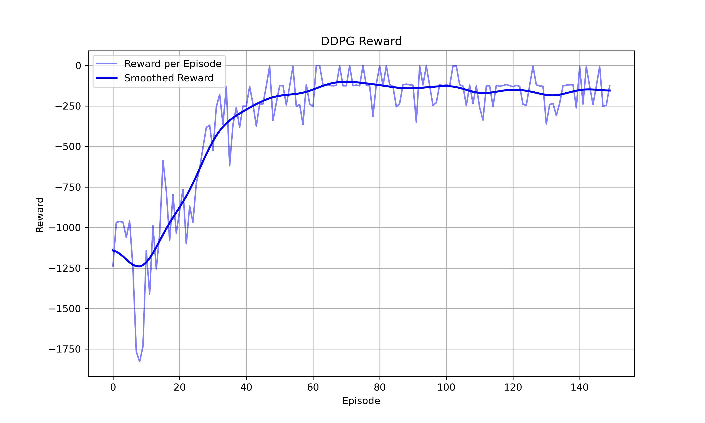

# DDPG Continuous Control

This repository implements a Deep Deterministic Policy Gradient (DDPG) agent for a continuous control task. The project contains a DDPG agent implementation, a training script, a reward curve, and several GIF visualizations showing the agent's behavior before training, during training, and after learning a good policy.

The trained agent can achieve an average reward of around **-150 within 100 evaluation episodes**, showing that the deterministic policy learns an effective control strategy for the continuous action environment.

## Repository Structure

```text
DDPG-continuous-control/
├── agent.py
├── training.py
├── reward_curve.png
├── gifs/
│   ├── before_training.gif
│   ├── episode_50.gif
│   ├── episode_100.gif
│   └── best_policy.gif
└── README.md
```

- `agent.py`: defines the DDPG agent, including the actor network, critic network, target networks, replay buffer, action selection, and parameter updates.
- `training.py`: runs the training loop, collects experience, updates the agent, evaluates the policy, and saves training results.
- `reward_curve.png`: shows the reward progression during training.
- `gifs/`: contains visualizations of the agent's behavior at different training stages.

## Method

This project uses **Deep Deterministic Policy Gradient**, an off-policy actor-critic reinforcement learning algorithm designed for continuous action spaces.

The main components are:

- **Actor network**: learns a deterministic policy that directly outputs continuous actions.
- **Critic network**: estimates the action-value function for state-action pairs.
- **Target networks**: stabilize training by slowly tracking the actor and critic networks.
- **Replay buffer**: stores past transitions and allows the agent to learn from randomly sampled experience.
- **Exploration noise**: encourages the agent to explore different actions during training.

Unlike stochastic policy-gradient methods such as PPO, DDPG learns from replayed experience and updates the policy using gradients from the critic.

## Training Result

After training, the agent learns a much more stable and effective control behavior compared with the untrained policy.

The average reward can reach approximately:

```text
Average reward over 100 evaluation episodes: about -150
```

This indicates that the trained policy has learned a strong control strategy for the environment.

## Reward Curve

The following figure shows the reward curve during training:



The reward generally improves as training progresses. Some fluctuations are expected because reinforcement learning performance can be affected by exploration noise, random initialization, and environment stochasticity.

## Behavior Visualization

The following GIFs show how the agent's behavior changes during training.

### Before Training

Before training, the agent has not learned a useful policy and its behavior is mostly ineffective.


### Episode 50

After 50 episodes, the agent begins to learn useful control behavior, but the policy may still be unstable.


### Episode 100

After 100 episodes, the policy becomes noticeably better and the agent can perform the task more effectively.


### Best Policy

The best saved policy shows the strongest behavior achieved during training.


## How to Run

Install the required dependencies first:

```bash
pip install torch numpy matplotlib gymnasium
```

If GIF generation or rendering is used, additional packages may be required:

```bash
pip install imageio
```

Then run the training script:

```bash
python training.py
```

## Notes

Training results may vary between runs because DDPG is sensitive to hyperparameters, random seeds, replay buffer sampling, exploration noise, and neural network initialization.

For more reproducible results, it is recommended to set random seeds for Python, NumPy, PyTorch, and the environment.

## Possible Improvements

Some possible future improvements include:

- tuning the actor and critic learning rates;
- adjusting the replay buffer size and batch size;
- improving the exploration noise schedule;
- saving and loading trained models;
- adding command-line arguments for training settings;
- comparing DDPG with PPO and other continuous control algorithms;
- testing the implementation on additional continuous control environments.

## License

This project is intended for learning and demonstration purposes.
